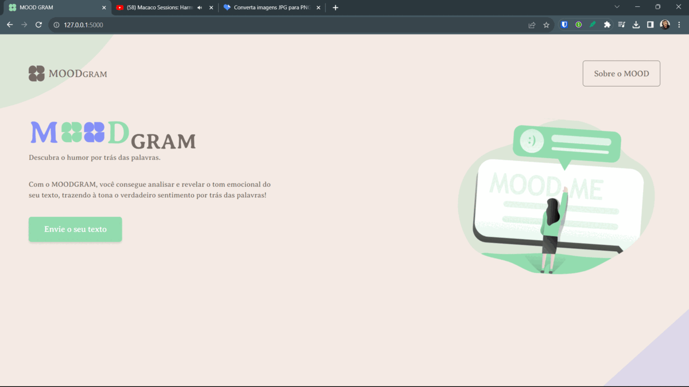

<p align="center">
  
</p>

<div align="center">
  <h2>🍃 MOODGram - Descubra o humor por trás das palavras 🍂</h2>
</div>

<div align="center">
  
  
</div>

## 📃 Descrição da Temática

Análise de sentimentos é o processo de analisar um texto digital para determinar se o tom emocional da mensagem é positivo, negativo ou neutro. Atualmente, as empresas têm grandes volumes de dados textuais, como e-mails, transcrições de chat de atendimento ao cliente, comentários em mídias sociais e avaliações. As ferramentas de análise de sentimentos podem escanear esse texto para determinar automaticamente a atitude do autor em relação a um tópico. As empresas usam os insights da análise de sentimentos para melhorar o atendimento ao cliente e aumentar a reputação da marca.

<p align="center">
  
</p>

Dito isso, o objetivo central consiste em desenvolver classificador de sentimentos de notícias eficiente, preciso e escalável. O modelo criado pelos times deve ser capaz de analisar o texto de uma notícia e determinar se o sentimento geral associado a ela é positivo, negativo ou neutro. A partir dessa classificação, uma empresa do segmento financeiro poderá tomar decisões informadas e estratégicas com base em dados confiáveis sobre a percepção pública de notícias relevantes.



## 📃 Documentos do Projeto

- Clique no link para acessar: [🔗 Documento de Especificação do Projeto](https://drive.google.com/file/d/1h0Lq8PiBgFHSuV0L9GA-sJgajzblYI97/preview)

## 🖌️ Protótipos de Interface

- Clique no link para acessar: [🔗 Link para o Figma](https://www.figma.com/file/I7dS63C0gmyqKB69vWiEn6/MOODGram---Dashboard?type=design&node-id=10%3A747&mode=design&t=CQ1BB3gFdLGHzK5J-1)

## ✅ To-do

* [X] [Escrever a Solução Proposta da Documentação](https://github.com/zairobastos/moodgram/issues/13)
* [X] [Segunda Reunião - Andamento das Atividades](https://github.com/zairobastos/moodgram/issues/11)
* [X] [Primeira Reunião - Debate sobre o Tema](https://github.com/zairobastos/moodgram/issues/10)
* [X] [Escrever a Introdução da Documentação](https://github.com/zairobastos/moodgram/issues/9)
* [X] [Análise Exploratória dos Dados](https://github.com/zairobastos/moodgram/issues/4)
* [X] [Prototipagem das Telas da Aplicação WEB](https://github.com/zairobastos/moodgram/issues/3)
* [X] [Tratamento dos Dados](https://github.com/zairobastos/moodgram/issues/1)
* [X] [Finalizar a API de conexão com a aplicação](https://github.com/zairobastos/moodgram/issues/16)
* [X] [Escrever o Pré-processamento dos Dados da Documentação](https://github.com/zairobastos/moodgram/issues/15)
* [X] [Escrever a Descrição dos Dados da Documentação](https://github.com/zairobastos/moodgram/issues/14)
* [X] [Terceira Reunião - Teste Pré-Apresentação](https://github.com/zairobastos/moodgram/issues/12)
* [X] [Documentação no Repositório GitHub](https://github.com/zairobastos/moodgram/issues/8)
* [X] [Validação dos Resultados e Performance do Algoritmo](https://github.com/zairobastos/moodgram/issues/7)
* [X] [Análise de Importância de Variáveis e Interpretabilidade](https://github.com/zairobastos/moodgram/issues/6)
* [X] [Seleção, Treinamento e Otimização de Algoritmo](https://github.com/zairobastos/moodgram/issues/5)
* [X] [Escrever a Introdução da Documentação](https://github.com/zairobastos/moodgram/issues/2)

## 🛠 Tecnologias
Naquela seção, trouxemos como instalar cada biblioteca separadamente:
### Pandas
O Pandas é uma biblioteca de análise de dados que oferece estruturas de dados flexíveis e eficientes, tornando a manipulação e análise de dados mais fácil. É frequentemente usado em conjunto com o NumPy.

#### Instalação
```bash
pip install pandas
```

### Scikit-Learn (sklearn)
Scikit-Learn é uma biblioteca de aprendizado de máquina em Python. Ela fornece ferramentas simples e eficientes para análise preditiva de dados, incluindo classificação, regressão, clustering, entre outras tarefas.

#### Instalação
```bash
pip install -U scikit-learn
```

### Streamlit
Streamlit é uma biblioteca para criar aplicativos da web interativos com apenas algumas linhas de código. É frequentemente utilizado para prototipagem rápida e visualização de dados.

#### Instalação
```bash
pip install streamlit
```

### Seaborn
Seaborn é uma biblioteca de visualização de dados baseada no Matplotlib. Ele fornece uma interface de alto nível para criar gráficos estatísticos atraentes e informativos.

#### Instalação
```bash
pip install seaborn
```

### NLTK (Natural Language Toolkit)
NLTK é uma biblioteca para processamento de linguagem natural. Ele contém ferramentas para trabalhar com textos, incluindo tokenização, stemming, lematização, análise gramatical, entre outras funcionalidades.

#### Instalação
```bash
pip install -U nltk
```

### Regular Expressions (re)
O módulo `re` é parte da biblioteca padrão do Python e é usado para trabalhar com expressões regulares, o que é útil para encontrar padrões em strings.

#### Instalação
Não é necessário instalar separadamente, pois faz parte da biblioteca padrão.

### Wordcloud
A biblioteca Wordcloud é usada para gerar nuvens de palavras a partir de um texto, onde o tamanho de cada palavra representa sua frequência no texto.

#### Instalação
```bash
pip install wordcloud
```

#### Plotly
Plotly é uma biblioteca para criação de gráficos interativos. Ele suporta uma variedade de tipos de gráficos e é útil para criar visualizações dinâmicas e atraentes.

#### Instalação
```bash
pip install plotly
```

## 👨‍💻👩‍💻 Desenvolvedores

<table align="center">
<tr>
  <td align="center"><a href="https://github.com/gabrielrudan"><br /><sub><b>Gabriel Rudan</b></sub></a><br /><p title="Front-End">💻</p></td>
  <td align="center"><a href="https://github.com/Raylander524"><br /><sub><b>Raylander Marques</b></sub></a><br /><p title="Front-End">💻</p></td>
  <td align="center"><a href="https://github.com/leh-torres"><br /><sub><b>Letícia Torres</b></sub></a><br /><p title="Back-End">💻</p></td>
  <td align="center"><a href="https://github.com/zairobastos"><br /><sub><b>Zairo Bastos</b></sub></a><br /><p title="Back-End">💻</p></td>
